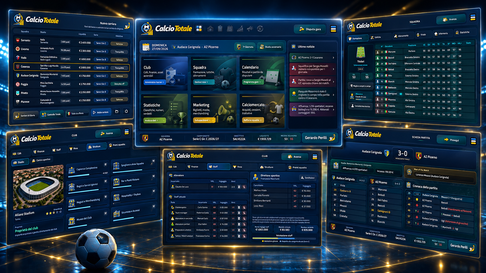

# CalcioTotale

[Versione italiana](README.md)

CalcioTotale is a local, single-player football management game centred on Italian club football. The current public build is **version 1.0 beta**, with a database updated for the **2025-26** season.

> **Language:** the game and its interface are currently available in Italian only.


---



---

## Download

Official packages from [Release v1.0beta](https://github.com/eleora-dev/calciototale/releases/tag/v1.0beta) are available for:

Packages updated on **19 August 2026**.

- [Windows 10/11 x64 — portable ZIP](https://github.com/eleora-dev/calciototale/releases/download/v1.0beta/CalcioTotale-1.0beta-windows-x64.zip)
- [Linux x86_64 — portable archive](https://github.com/eleora-dev/calciototale/releases/download/v1.0beta/CalcioTotale-1.0beta-linux-x86_64.tar.gz)
- [Fedora 44 x86_64 — RPM package](https://github.com/eleora-dev/calciototale/releases/download/v1.0beta/calciototale-1.0-0.beta.1.fc44.x86_64.rpm)
- [macOS 13+ Apple Silicon](https://github.com/eleora-dev/calciototale/releases/download/v1.0beta/CalcioTotale-1.0beta-macOS-arm64.zip)
- [macOS 13+ Intel](https://github.com/eleora-dev/calciototale/releases/download/v1.0beta/CalcioTotale-1.0beta-macOS-x86_64.zip)

The packages are self-contained: Python and Python packages do not need to be installed. This repository distributes official executable builds only; the source code is private.

### Integrity verification

To verify downloaded files, use [SHA256SUMS](https://github.com/eleora-dev/calciototale/releases/download/v1.0beta/SHA256SUMS).

## Installation and startup

### Windows

Extract the complete ZIP into a writable folder, open the `CalcioTotale` directory and run `CalcioTotale.exe`. This is a portable build: do not run it directly from the ZIP and do not place it in `Program Files`. Saves are stored in `saves/` beside the executable.

### Linux

For the portable version, extract the archive and run `CalcioTotale/CalcioTotale`. The build is produced and tested on Fedora 44. On Fedora, you can install the RPM instead:

```bash
sudo dnf install ./calciototale-1.0-0.beta.1.fc44.x86_64.rpm
```

The portable build stores `saves/` beside the executable; the RPM uses `${XDG_DATA_HOME:-$HOME/.local/share}/calciototale/saves/`.

### macOS

Choose the `arm64` package for Apple Silicon Macs or `x86_64` for Intel Macs. Extract the ZIP and drag `CalcioTotale.app` into `Applications`. Saves are stored in `~/Library/Application Support/CalcioTotale/saves/` and remain separate from the application.

## Operating-system security warnings

The Windows build does not yet have a code signature and may trigger a Microsoft Defender SmartScreen warning. The macOS builds have an ad-hoc signature but are neither signed with an Apple Developer ID certificate nor notarized by Apple; Gatekeeper may therefore require you to confirm the first launch by right-clicking the app and selecting **Open**. Download packages only from this official repository and verify `SHA256SUMS` before use.

## Main features

- two career modes: *Solo la Maglia* and *Sentieri di Gloria*;
- Serie A, Serie B and all three Serie C groups, with 100 selectable Italian clubs plus 121 European and international clubs in the base database;
- Coppa Italia, Coppa Italia Serie C, Supercoppa Italiana, play-offs and play-outs;
- UEFA competitions, Intercontinental Cup and Club World Cup;
- formations, line-ups, tactics, roles, shirt numbers, training, injuries, suspensions and match reports;
- transfers, loans, negotiations, pre-contracts, scouting and youth development;
- finances, board objectives, staff, stadium and training-centre development;
- ticketing, sponsors, TV rights, press, social channels and merchandising;
- tables, calendars, statistics, awards, records and contextual news;
- nine local career slots.

## Privacy

CalcioTotale is an offline desktop game:

- no account or remote server is required;
- it does not include telemetry, analytics or advertising;
- normal gameplay does not make network requests;
- career data remains on the user's device unless the user copies or shares it.

The links in the About dialog open the default browser only when selected. See the complete bilingual [privacy policy](privacy.html) for further details.

## Licence and rights

The official build may be downloaded, installed and used for personal, non-commercial purposes under the [CalcioTotale proprietary licence](LICENSE). Redistribution, modification, publication, commercial use and attempts to derive the source code are not permitted without prior written authorisation.

Third-party components and materials, including Qt/PySide6, PyInstaller, icons, fonts and development-tool dependencies, remain subject to their respective licences, terms and rights. See [THIRD_PARTY_NOTICES.md](THIRD_PARTY_NOTICES.md) and the [`licenses/`](licenses/) directory.

CalcioTotale is an unofficial project and is not affiliated with, endorsed by or sponsored by any football federation, league, competition, club, player or data provider.

## Author

Gerardo Perilli · [Eleòra](https://github.com/eleora-dev)
