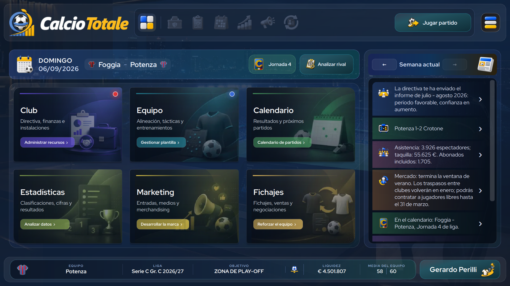
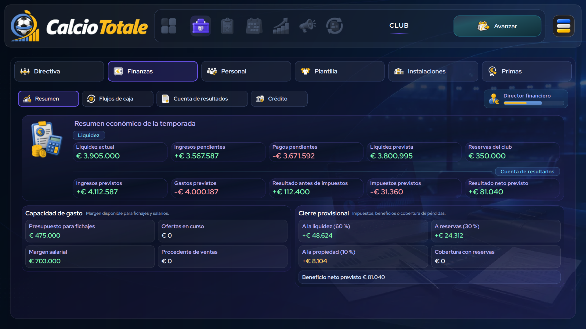
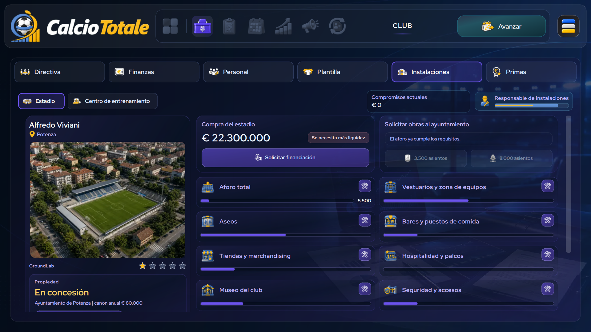
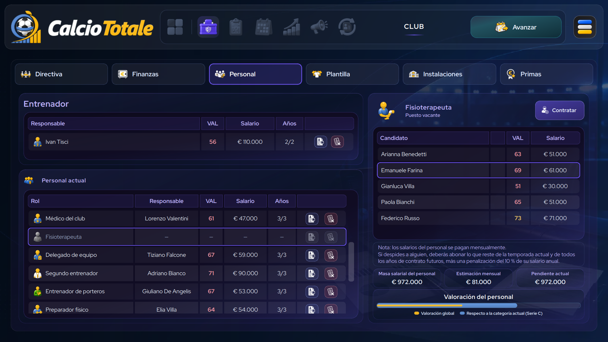
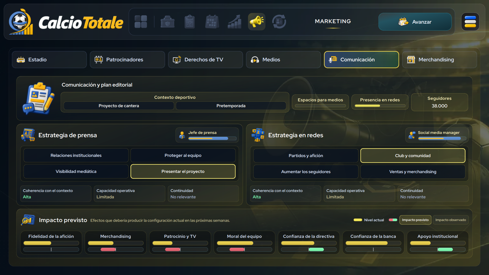
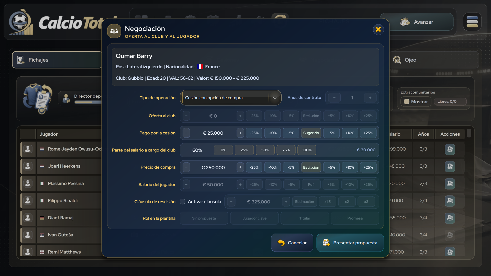
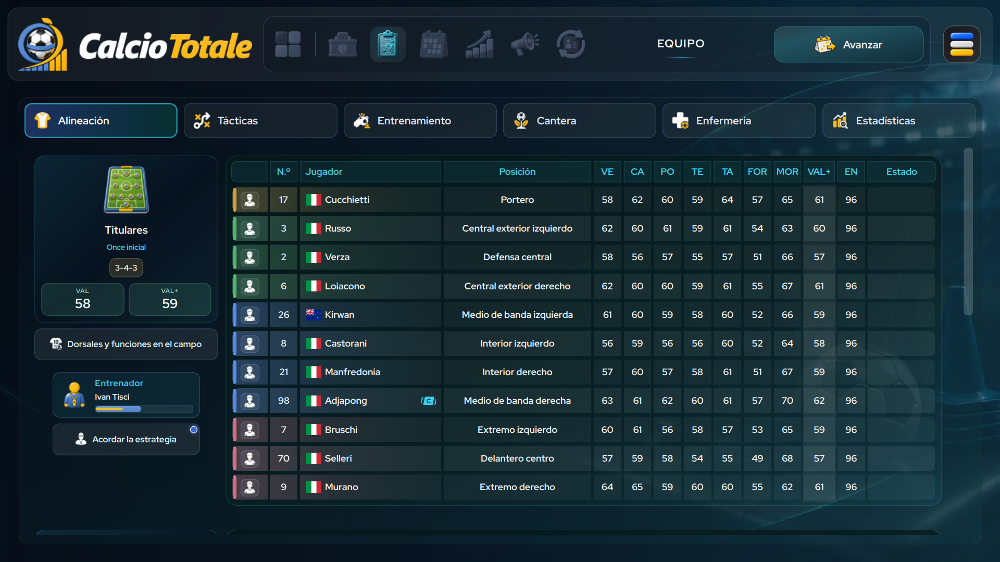
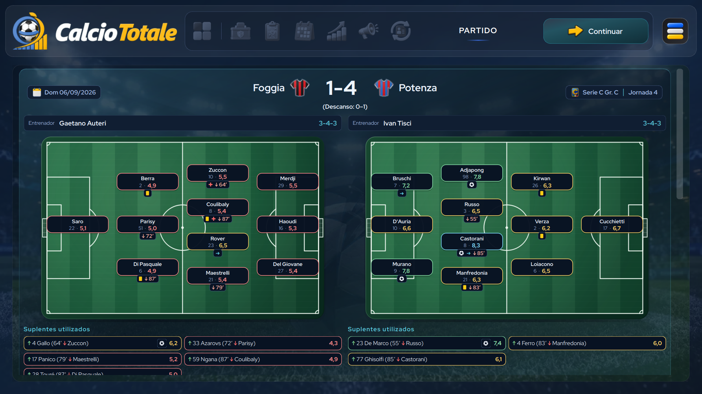
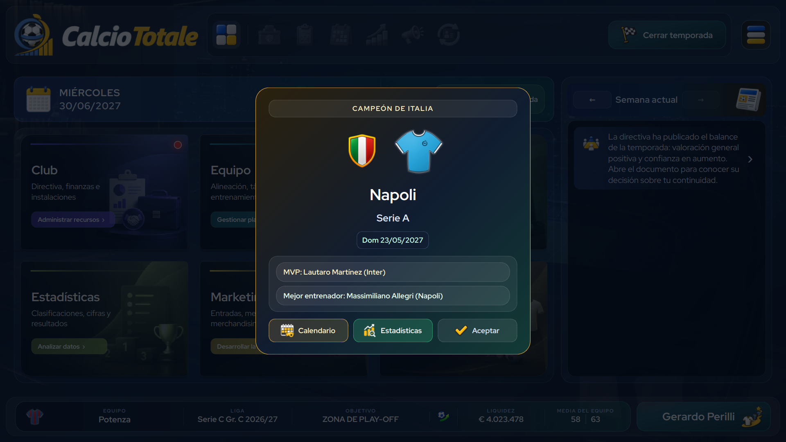
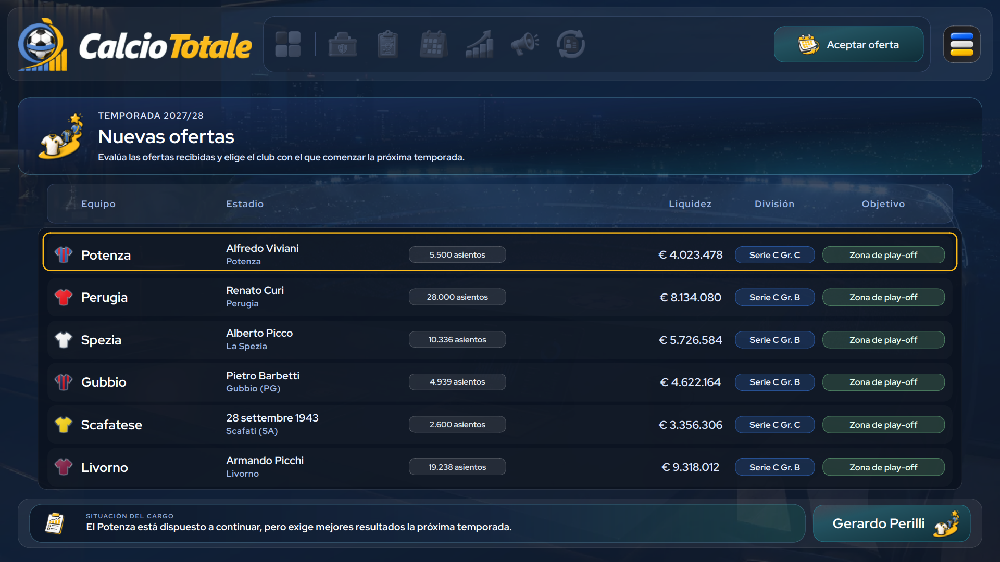

# CalcioTotale

[Versión italiana](README.it.md) · [English version](README.md)

**CalcioTotale** es un juego de gestión futbolística para un solo jugador que recupera el espíritu de los clásicos del género desde otra perspectiva: en lugar de asumir el papel habitual de entrenador y mánager, diriges un club como director general. Define la estrategia de la entidad, construye una estructura sostenible y afronta las consecuencias deportivas y económicas de cada decisión.

Está desarrollado en Python y PySide6. La versión **1.0.4** se está preparando para su lanzamiento el **7 de octubre de 2026**. La aplicación se distribuye junto con un paquete de datos futbolísticos sustituible, actualizado para la temporada **2026-27**.

> **Idiomas:** la interfaz está disponible en italiano, inglés y español.


---

<table>
  <tr>
    <td width="20%"><a href="assets/branding/screenshots/es/01_home_es.png"></a></td>
    <td width="20%"><a href="assets/branding/screenshots/es/02_finances_es.png"></a></td>
    <td width="20%"><a href="assets/branding/screenshots/es/03_facilities_es.png"></a></td>
    <td width="20%"><a href="assets/branding/screenshots/es/04_staff_es.png"></a></td>
    <td width="20%"><a href="assets/branding/screenshots/es/05_marketing_es.png"></a></td>
  </tr>
  <tr>
    <td width="20%"><a href="assets/branding/screenshots/es/06_transfer_es.png"></a></td>
    <td width="20%"><a href="assets/branding/screenshots/es/07_squad_es.png"></a></td>
    <td width="20%"><a href="assets/branding/screenshots/es/08_matchday_es.png"></a></td>
    <td width="20%"><a href="assets/branding/screenshots/es/09_verdict_es.png"></a></td>
    <td width="20%"><a href="assets/branding/screenshots/es/10_career_es.png"></a></td>
  </tr>
</table>

---

## El juego

- **Dos modos de carrera** — *Siempre fiel* te vincula a un único club; *Camino a la gloria* sigue la trayectoria de un dirigente desde las categorías inferiores, con ofertas de otros clubes, evaluaciones de la directiva y la posibilidad de ser destituido.
- **Control técnico configurable** — si desactivas *Control total*, delegas las alineaciones, las tácticas, los entrenamientos y la dirección de los partidos en el cuerpo técnico, según su capacidad y el mandato recibido. Si lo activas, tomas personalmente todas las decisiones técnicas.
- **Cinco ligas jugables** — Serie A, Serie B y los tres grupos de Serie C. El paquete de datos de la temporada incluye 100 clubes italianos seleccionables y otros 145 clubes europeos e internacionales no seleccionables.
- **Fútbol nacional** — ligas, Coppa Italia, Coppa Italia Serie C, Supercoppa Italiana, play-offs y play-outs de Serie B y fase posterior a la liga de Serie C.
- **Competiciones internacionales** — UEFA Champions League, Europa League, Conference League, Supercopa de la UEFA, Copa Intercontinental y Mundial de Clubes, con eliminatorias de clasificación, sorteos, fases de liga y continuidad entre temporadas.
- **Gestión de la plantilla y los partidos** — sistemas de juego, alineaciones, tácticas, dorsales, roles, preparación de encuentros, entrenamiento semanal, lesiones, enfermedades, sanciones y crónicas de los partidos.
- **Gestión del club** — objetivos e informes de la directiva, flujos de caja, cuenta de resultados, contabilidad de traspasos, contratos, primas, crédito, ampliaciones de capital, personal, estadio y desarrollo del centro de entrenamiento, con renegociación del canon con el propietario del estadio.
- **Fichajes y ojeo** — incorporaciones, ventas, cesiones, negociaciones, precontratos, listas de transferibles y cedibles, seguimiento de futbolistas y búsqueda de jóvenes promesas.
- **Gestión comercial** — venta de entradas y abonos, patrocinadores, derechos televisivos, prensa y comunicados oficiales, redes sociales y productos del club.
- **Cantera y desarrollo** — jóvenes de la cantera, ascenso al primer equipo, evolución técnica, personalidad y seguimiento individual.
- **Estadísticas y noticias** — clasificaciones, calendarios, filtros por competición, informes de jugadores y equipos, premios, récords y noticias relacionadas con la partida.
- **Partidas guardadas localmente** — nueve espacios de guardado en la carpeta `user/`. Las versiones portátiles para Windows y Linux la mantienen junto al ejecutable; los paquetes de sistema utilizan la carpeta de datos del usuario y macOS utiliza `~/Library/Application Support/CalcioTotale/user/`.
- **Selección de idioma** — los catálogos de italiano, inglés y español comparten la misma estructura. El idioma inicial sigue la configuración del sistema y la elección manual se guarda localmente.

## Funcionamiento y privacidad

CalcioTotale es un juego de escritorio sin conexión:

- no crea ni requiere una cuenta propia ni un servidor gestionado por Eleòra;
- no utiliza telemetría, análisis de uso ni servicios publicitarios;
- durante el juego normal no realiza solicitudes de red;
- guarda las carreras en el dispositivo; en la edición de Steam, el cliente de Steam puede sincronizarlas si Steam Cloud está activado.

Los enlaces de la ventana «Información» abren el navegador predeterminado solo cuando se seleccionan. En ese caso, es el navegador quien se conecta al sitio enlazado, no el juego.

Consulta [privacy.html](privacy.html) para leer la política de privacidad completa, disponible en italiano e inglés.

## Descripción técnica

En la estructura del proyecto, **CalcioTotale** designa la aplicación. La carpeta `data/` completa constituye un paquete independiente y sustituible de contenido futbolístico. Se coloca junto a la aplicación para que esta pueda leerlo localmente, pero no forma parte del material propietario de CalcioTotale.

- `data/data.json.gz` contiene los datos de la temporada en JSON UTF-8 comprimido con gzip: 245 clubes, 6475 jugadores, nombres, abreviaturas, organizadores, colores y diseños de camisetas identificativas y rutas de los iconos de las competiciones.
- `data/competitions/` pertenece al mismo paquete independiente y contiene las imágenes a las que hacen referencia los datos de la temporada.
- `catalogs/` contiene la lectura y escritura de la base de datos, los esquemas de registros estáticos y el acceso a los catálogos sustituibles del juego.
- `models/` define clubes, jugadores, personal, partidos, clasificaciones, instalaciones, datos económicos y criterios de los objetivos de temporada.
- `engine/` contiene la creación del mundo de juego, la simulación de partidos, los calendarios, las competiciones, los traspasos, los contratos, las finanzas, las noticias, los entrenamientos y el avance entre temporadas.
- `ui/` contiene la interfaz PySide6, los cuadros de diálogo, el estilo y la lógica de presentación.
- `locales/locale_it.py`, `locales/locale_en.py` y `locales/locale_es.py` contienen los catálogos de italiano, inglés y español; `locales/runtime_settings.py` gestiona la preferencia de idioma local.
- `assets/` contiene la identidad gráfica, los fondos, los iconos de la interfaz, las banderas, las fuentes y otros recursos visuales ajenos a las competiciones.
- `user/` se crea durante la ejecución para las partidas guardadas y sus resúmenes.

El entorno de referencia es Fedora Linux con KDE Plasma. El código también incluye gestión de pantalla para Windows y macOS, pero solo deben considerarse compatibles las plataformas para las que se publique expresamente una versión oficial.

## Requisitos para ejecutar el código fuente

- Python 3.10 o posterior
- PySide6 6.7 o posterior, anterior a la versión 7
- un entorno de escritorio gráfico funcional
- una pantalla de al menos 1280 × 720 para el área de juego fija de 1600 × 900 y su escalado automático entre plataformas

Para una copia de desarrollo autorizada:

```bash
python3 -B -m venv .venv
source .venv/bin/activate
python3 -B -m pip install -r requirements.txt
python3 -B calciototale.py
```

Para iniciar la demo directamente desde la misma copia del código fuente:

```bash
python3 -B calciototale.py --demo
```

## Pruebas de desarrollo

El ejecutor incluye pruebas `unittest` y funciones `test_*`, y ejecuta cada módulo en un proceso separado con datos de usuario temporales. La batería completa se divide en cuatro bloques secuenciales y ejecuta un solo módulo cada vez para evitar picos de memoria. Las pruebas de la interfaz utilizan Qt sin pantalla visible.

```bash
PYTHONPATH=. python3 -B tools/run_tests.py
```

El estado, los registros y los errores se guardan de forma atómica después de cada módulo en `.test-results/full-suite`. Tras una interrupción, `--resume` ejecuta solo los módulos pendientes o interrumpidos; `--retry-failures` repite los que no se superaron. Una ejecución sin estas opciones inicia una sesión nueva. Para limitar las pruebas a uno o varios módulos, indica sus nombres sin `.py`. Las opciones `--parts`, `--jobs`, `--timeout` y `--log-dir` permiten modificar expresamente los valores predeterminados.

```bash
PYTHONPATH=. python3 -B tools/run_tests.py --resume
PYTHONPATH=. python3 -B tools/run_tests.py --retry-failures
```

## Distribución

El repositorio del código fuente, `calciototale-src`, es privado. La versión completa se distribuye a través de [Steam](https://store.steampowered.com/app/5247020/Calcio_Totale/). El repositorio público [`calciototale`](https://github.com/eleora-dev/calciototale) distribuye exclusivamente los paquetes de la demo.

Las versiones ejecutables oficiales solo pueden descargarse, instalarse y utilizarse para uso personal y no comercial, de acuerdo con la [licencia](LICENSE). El acceso al código fuente, la redistribución, la modificación, la publicación y el uso comercial requieren autorización previa por escrito. No redistribuyas las versiones ejecutables ni recurras a sitios de descarga no oficiales.

El procedimiento para crear la versión portátil de Windows x64 se documenta en [packaging/windows/README.md](packaging/windows/README.md). Las versiones portátil de Linux x86_64 y RPM para Fedora se documentan en [packaging/linux/README.md](packaging/linux/README.md). El paquete `.app` para Apple Silicon, Mac con procesador Intel o Universal 2, incluida la firma y la notarización, se documenta en [packaging/macos/README.md](packaging/macos/README.md). Todos estos formatos generan un paquete autónomo con la aplicación, sus dependencias y el paquete de contenido independiente situado en `data/`; el usuario final no necesita instalar paquetes de Python.

El flujo de trabajo manual `Build Steam and demo packages` crea y verifica ambas ediciones para Windows x64 y Linux x86_64 en el entorno de Steam. Los paquetes completos permanecen como artefactos privados destinados a los depósitos de Steam. Cuando se solicita su publicación, solo los paquetes de la demo se suben a una versión publicada en el repositorio público [`calciototale`](https://github.com/eleora-dev/calciototale). Los procedimientos de macOS y RPM siguen disponibles para uso manual, pero están excluidos de la distribución actual.

Durante la creación de paquetes, los módulos de interfaz cargados dinámicamente se transforman en un paquete binario comprimido. Cada script de empaquetado detiene el proceso si encuentra un archivo fuente de Python `.py` en texto claro en el paquete final.

## Estructura del proyecto

```text
assets/                   Identidad gráfica, fondos, iconos, banderas, fuentes y recursos de interfaz
catalogs/                 Lectura y escritura de datos estáticos, esquemas, configuración y catálogos
data/                     Paquete independiente y sustituible de contenido futbolístico
engine/                   Mundo de juego, simulación y gestión del estado
licenses/                 Textos de las licencias de componentes de terceros
locales/                  Catálogos de idiomas y preferencias lingüísticas
models/                   Modelos de dominio, identificadores, criterios y constantes
packaging/windows/        Configuración de PyInstaller y script de empaquetado PowerShell
packaging/linux/          Paquete Linux común, archivo portátil y paquete RPM
packaging/macos/          Paquete .app, firma, notarización y archivo ZIP
engine/runtime_paths.py   Rutas de datos específicas de las versiones de escritorio
ui/                       Interfaz PySide6, paleta de colores y estilos
calciototale.py           Punto de entrada de la aplicación
LICENSE                   Licencia propietaria de CalcioTotale
THIRD_PARTY_NOTICES.md    Componentes y recursos de terceros y sus derechos
privacy.html              Política de privacidad en italiano e inglés
user/                     Partidas, resúmenes y preferencias locales; se crea cuando es necesario
```

## Licencia y derechos de terceros

El código original de CalcioTotale, su documentación y los recursos originales de la aplicación son propietarios; todos los derechos están reservados. La carpeta `data/` completa es un paquete de contenido independiente y queda excluida de la licencia propietaria. Consulta [LICENSE](LICENSE).

Los componentes y materiales de terceros siguen sujetos a sus respectivas licencias, condiciones y titulares de derechos. El repositorio documenta en particular:

- **Python** — Python Software Foundation License Version 2 y las licencias de los componentes incluidos en la distribución de Python;
- **PySide6 / Qt for Python** — las compilaciones automatizadas utilizan la distribución Community bajo LGPLv3/GPLv3; una distribución comercial de Qt requiere un procedimiento y unas condiciones independientes;
- **PyInstaller** — GPLv2 o posterior, con una excepción específica para el *bootloader* incluido en los ejecutables;
- **Pillow** — licencia MIT-CMU; se utiliza únicamente al empaquetar los iconos y no durante la ejecución del juego;
- **Google Material Symbols / Material Design icons** — licencia Apache 2.0 para los iconos derivados a los que corresponda;
- **Red Hat Display** — SIL Open Font License 1.1; se utiliza en la interfaz y en los textos del tráiler;
- **Oxanium** — SIL Open Font License 1.1; se utiliza para los patrocinadores de las camisetas y los títulos del tráiler;
- **flag-icons** — licencia MIT para las banderas SVG a las que corresponda;
- **Kenney Cursor Pack** — licencia CC0 1.0 para los cursores de flecha, mano, ayuda y texto;
- **paquete `data/`** — su base de datos y las imágenes de las competiciones son independientes de la aplicación; los derechos correspondientes siguen perteneciendo a sus respectivos titulares.

Consulta [THIRD_PARTY_NOTICES.md](THIRD_PARTY_NOTICES.md) y la carpeta [`licenses/`](licenses/). CalcioTotale es un proyecto no oficial: no está afiliado a ninguna federación, liga, competición, club, jugador o proveedor de datos, ni cuenta con su aprobación o patrocinio.

## Autor

Gerardo Perilli · [Eleòra](https://github.com/eleora-dev)
