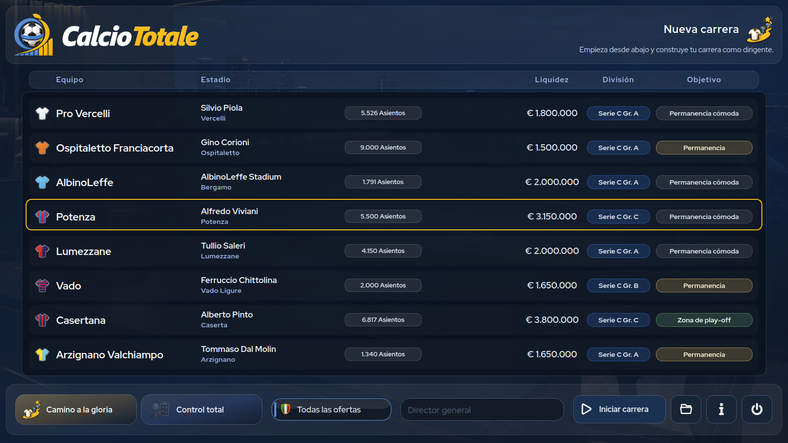

# CalcioTotale

[English](README.md) · [Italiano](README.it.md)

**CalcioTotale** es un juego de gestión futbolística para un solo jugador, ambientado en el fútbol italiano. Te pones al frente de un club como director ejecutivo y tomas decisiones deportivas y económicas. Este repositorio distribuye la **demo gratuita 1.0.2**, con contenido futbolístico de la temporada 2026–27.

> **Idiomas:** español, italiano e inglés. La demo incluye todas las funciones del juego, pero cada carrera termina al finalizar la primera vuelta de la temporada inicial.

  

<table>
  <tr>
    <td width="20%"></td>
    <td width="20%"></td>
    <td width="20%"></td>
    <td width="20%"></td>
    <td width="20%"></td>
  </tr>
  <tr>
    <td width="20%"></td>
    <td width="20%"></td>
    <td width="20%"></td>
    <td width="20%"></td>
    <td width="20%"></td>
  </tr>
</table>

## Descargar la demo

Paquetes actualizados el **1 de octubre de 2026**. Descárgalos desde la [versión oficial 1.0.2](https://github.com/eleora-dev/calciototale/releases/tag/v1.0.2):

- [Windows 10/11 x64 — ZIP portátil](https://github.com/eleora-dev/calciototale/releases/download/v1.0.2/CalcioTotale-1.0.2-demo-windows-x64.zip)
- [Linux x86_64 — archivo portátil](https://github.com/eleora-dev/calciototale/releases/download/v1.0.2/CalcioTotale-1.0.2-demo-linux-x86_64.tar.gz)
- [Sumas SHA256 para verificar las descargas](https://github.com/eleora-dev/calciototale/releases/download/v1.0.2/SHA256SUMS)

Ambos paquetes incluyen todo lo necesario y no requieren instalar Python. La versión completa y el código fuente no se publican en este repositorio.

## Instalación e inicio

**Windows:** Extrae por completo el ZIP en una carpeta con permisos de escritura, abre `CalcioTotale` y ejecuta `CalcioTotale.exe`. No inicies el juego desde el ZIP ni coloques la carpeta portátil en `Program Files`.

**Linux:** Extrae el archivo y ejecuta `CalcioTotale/CalcioTotale`. La versión se generó y comprobó en el entorno Linux de Steam para sistemas de escritorio x86_64.

Las versiones portátiles guardan las partidas en `user/`, junto al ejecutable. La versión de Windows no está firmada y puede mostrar un aviso de Microsoft Defender SmartScreen; descarga los archivos solo de este repositorio oficial y comprueba la suma SHA256 publicada.

## Características principales

- *Siempre fiel* te mantiene en un club; *Camino a la gloria* sigue tu carrera directiva por distintos equipos.
- Dirige las alineaciones, las tácticas, los entrenamientos y los partidos, o delega las decisiones técnicas en tu personal.
- Gestiona clubes de la Serie A, la Serie B y los tres grupos de la Serie C: 100 equipos italianos seleccionables y otros 145 clubes en el paquete de temporada.
- Disputa competiciones nacionales e internacionales, incluidas copas, eliminatorias de ascenso y descenso y torneos de la UEFA.
- Ocúpate de fichajes, cesiones, contratos, ojeadores, cantera, personal, finanzas, estadio y actividades comerciales.
- Consulta clasificaciones, calendarios, crónicas, estadísticas y noticias relacionadas con tu carrera; guarda tus partidas localmente en nueve espacios.

El lanzamiento de la versión completa en [Steam](https://store.steampowered.com/app/5247020/Calcio_Totale/) está previsto para el **7 de octubre de 2026**.

## Privacidad y derechos

CalcioTotale es un juego de escritorio que funciona sin conexión. No requiere una cuenta de CalcioTotale ni utiliza telemetría o publicidad. Las partidas se guardan en el dispositivo. Consulta la [política de privacidad](privacy.html), disponible en inglés e italiano, para obtener más información.

Las versiones oficiales pueden utilizarse con fines personales y no comerciales según la [licencia de CalcioTotale](LICENSE). La redistribución, modificación, publicación y explotación comercial requieren autorización previa por escrito. Los materiales de terceros conservan sus propios derechos; consulta los [avisos sobre terceros](THIRD_PARTY_NOTICES.md) y los [textos de las licencias](licenses/README.md).

CalcioTotale es un proyecto no oficial y no está afiliado a ninguna federación, liga, competición, club, jugador o proveedor de datos, ni cuenta con su aprobación.

Gerardo Perilli · [Eleòra](https://github.com/eleora-dev)
