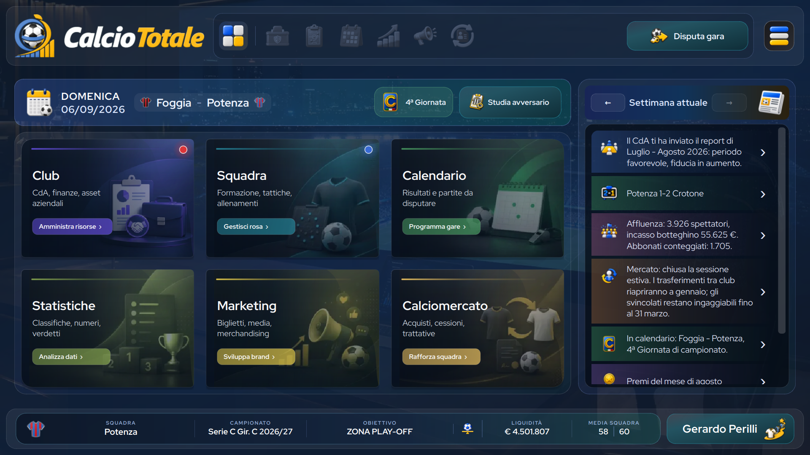
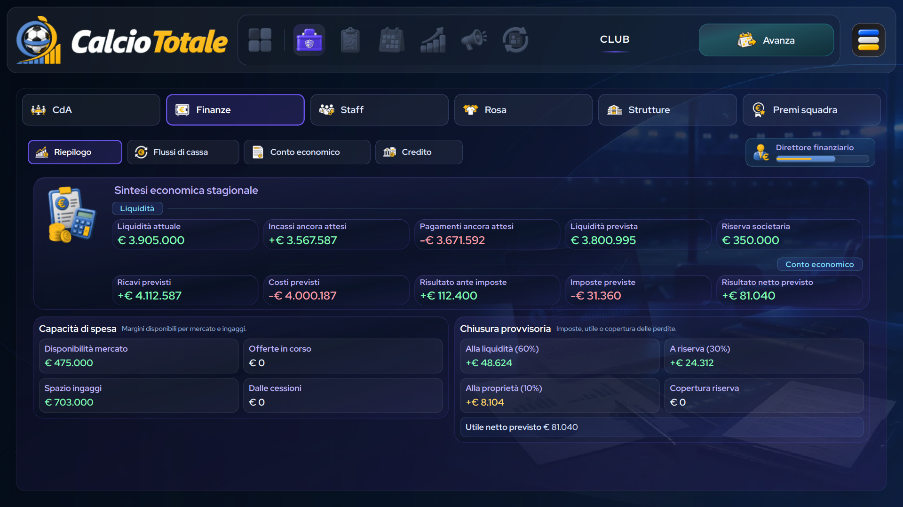
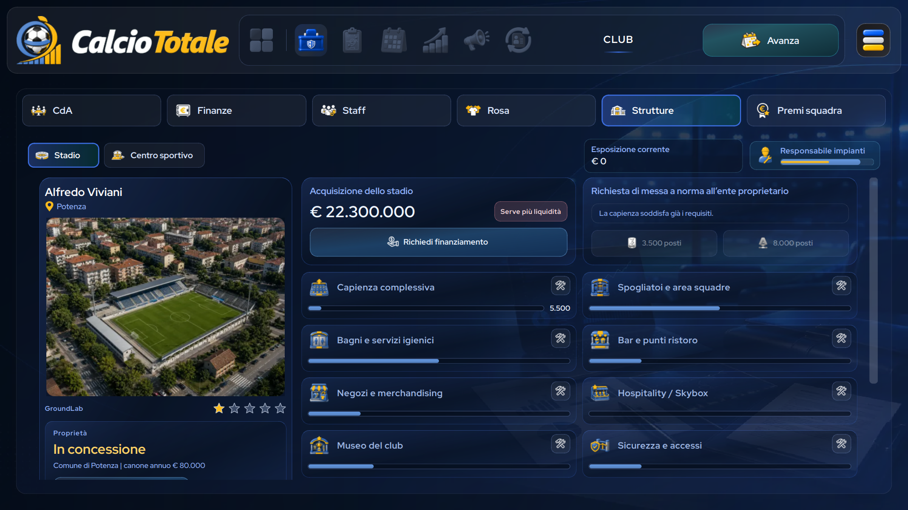
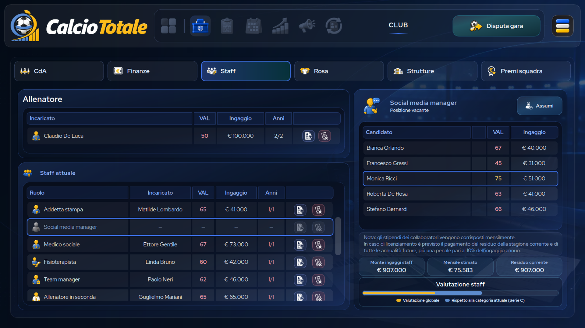
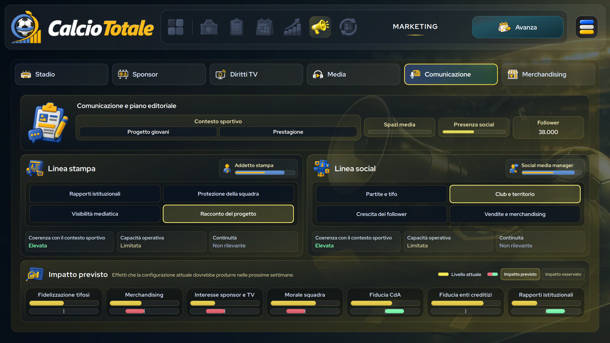
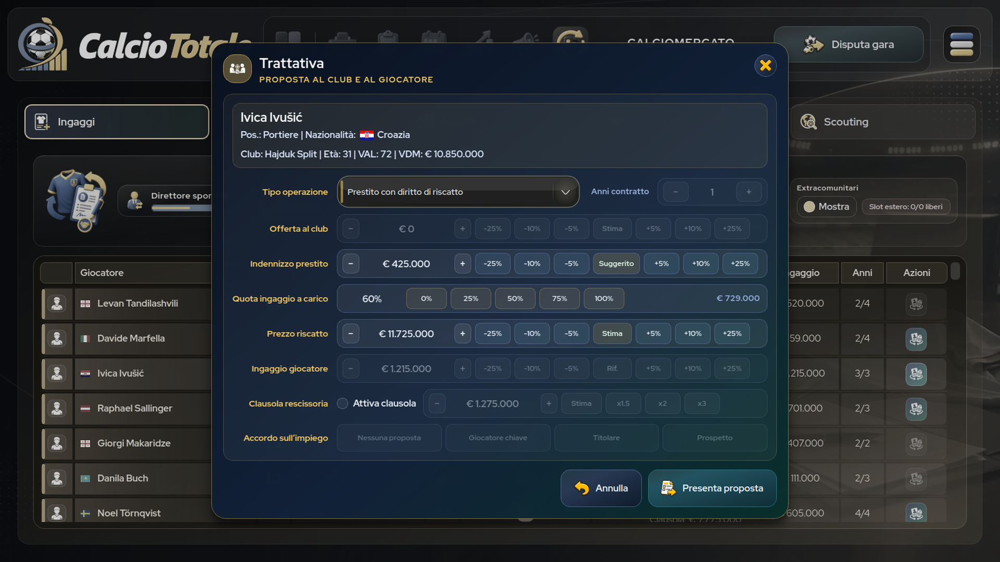
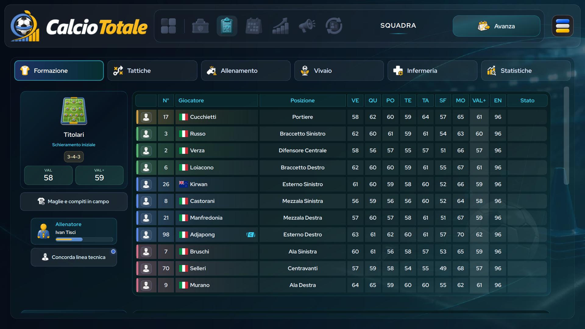
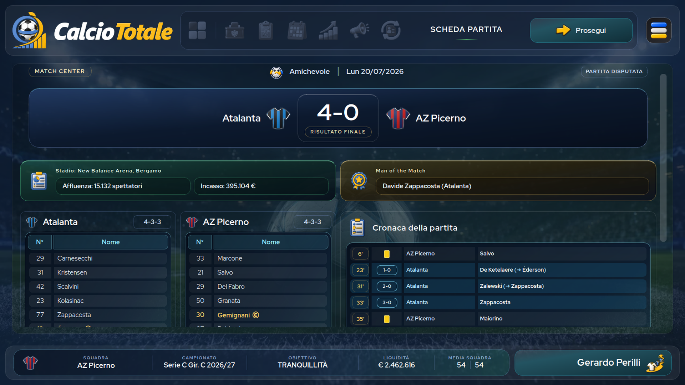
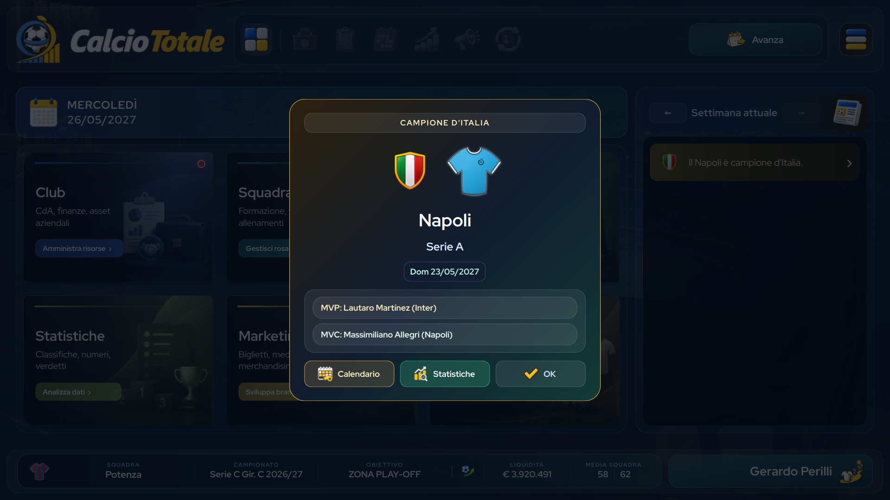
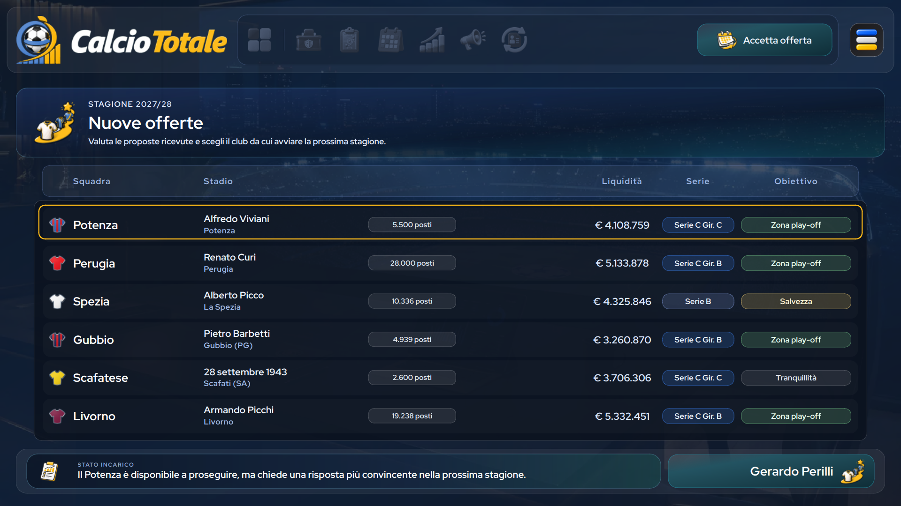

# CalcioTotale

[English version](README.md) · [Versión española](README.es.md)

**CalcioTotale** è un gestionale calcistico per giocatore singolo che riprende lo spirito dei classici del genere, ma cambiandone il punto di vista: non interpreti più il tradizionale allenatore-manager, bensì l’amministratore delegato di un club. Definisci la strategia della società, costruisci una struttura sostenibile e affronta le conseguenze sportive ed economiche di ogni decisione.

È sviluppato in Python e PySide6. La versione attuale del gioco è **1.0.6**. L'applicazione è accompagnata da un pacchetto di contenuti calcistici sostituibile aggiornato alla stagione **2026-27**.

> **Lingue:** interfaccia disponibile in italiano, inglese e spagnolo.


---

<table>
  <tr>
    <td width="20%"><a href="assets/branding/screenshots/it/01_home_it.png"></a></td>
    <td width="20%"><a href="assets/branding/screenshots/it/02_finances_it.png"></a></td>
    <td width="20%"><a href="assets/branding/screenshots/it/03_facilities_it.png"></a></td>
    <td width="20%"><a href="assets/branding/screenshots/it/04_staff_it.png"></a></td>
    <td width="20%"><a href="assets/branding/screenshots/it/05_marketing_it.png"></a></td>
  </tr>
  <tr>
    <td width="20%"><a href="assets/branding/screenshots/it/06_transfer_it.png"></a></td>
    <td width="20%"><a href="assets/branding/screenshots/it/07_squad_it.png"></a></td>
    <td width="20%"><a href="assets/branding/screenshots/it/08_matchday_it.png"></a></td>
    <td width="20%"><a href="assets/branding/screenshots/it/09_verdict_it.png"></a></td>
    <td width="20%"><a href="assets/branding/screenshots/it/10_career_it.png"></a></td>
  </tr>
</table>

---

## Il gioco

- **Due modalità carriera** — *Solo la Maglia* lega il giocatore a un unico club, mentre *Sentieri di Gloria* segue la carriera di un dirigente dalle serie inferiori attraverso offerte, valutazioni e possibili revoche dell'incarico.
- **Controllo tecnico configurabile** — quando *Controllo totale* non è attivo, formazione, tattiche, allenamento e gestione della gara sono delegati allo staff tecnico secondo qualità e mandato assegnato; attivandolo, ogni scelta tecnica passa direttamente al giocatore.
- **Cinque campionati giocabili** — Serie A, Serie B e tutti e tre i gironi di Serie C, con 100 club italiani selezionabili e altri 145 club europei e internazionali non selezionabili nel pacchetto stagionale fornito.
- **Calcio nazionale** — campionati, Coppa Italia, Coppa Italia Serie C, Supercoppa Italiana, play-off e play-out di Serie B e fase post-campionato di Serie C.
- **Competizioni internazionali** — UEFA Champions League, Europa League, Conference League, Supercoppa UEFA, Coppa Intercontinentale e Mondiale per Club, con play-off di qualificazione, sorteggi, fasi campionato e progressione tra le stagioni.
- **Gestione della squadra e delle partite** — moduli, formazioni, tattiche, numeri di maglia, ruoli, preparazione della gara, allenamento settimanale, infortuni, malattie, squalifiche e cronache delle partite.
- **Gestione societaria** — obiettivi e relazioni della dirigenza, flussi di cassa, conto economico, contabilità dei cartellini, contratti, premi, credito, ricapitalizzazioni, staff, stadio e sviluppo del centro di allenamento, con rinegoziazione del canone con l’ente proprietario.
- **Calciomercato e osservazione** — acquisti, cessioni, prestiti, trattative, precontratti, liste in uscita, giocatori osservati e ricerca di giovani talenti.
- **Gestione commerciale** — biglietteria e abbonamenti, sponsor, diritti televisivi, stampa e comunicazione ufficiale, canali social e merchandising.
- **Settore giovanile e crescita** — giovani del vivaio, percorsi di promozione, sviluppo tecnico, personalità e gestione individuale.
- **Statistiche e notizie** — classifiche, calendari, filtri per competizione, rapporti su giocatori e squadre, premi, record e notizie contestuali.
- **Salvataggi locali** — nove slot carriera nella cartella locale `user/`; le build portabili Windows e Linux la mantengono accanto all'eseguibile, i pacchetti di sistema usano la cartella dati dell'utente e macOS usa `~/Library/Application Support/CalcioTotale/user/`.
- **Tre lingue per l'interfaccia** — italiano, inglese e spagnolo condividono la stessa struttura di localizzazione; la lingua predefinita segue il sistema e la scelta manuale viene conservata localmente.

## Funzionamento e privacy

CalcioTotale è un gioco desktop offline:

- non crea né richiede un proprio account o un server gestito da Eleòra;
- non utilizza telemetria, sistemi di analisi o servizi pubblicitari;
- durante il normale utilizzo non effettua richieste di rete;
- i dati delle carriere vengono salvati localmente; nell'edizione Steam possono essere sincronizzati dal client Steam quando Steam Cloud è abilitato.

I collegamenti nella finestra Informazioni aprono il browser predefinito soltanto quando vengono selezionati; l'eventuale connessione viene effettuata dal browser verso il sito collegato, non dal gioco.

Consulta [privacy.html](privacy.html) per l'informativa sulla privacy completa in italiano e inglese.

## Panoramica tecnica

Nella struttura del progetto, **CalcioTotale** indica l'applicazione, mentre l'intera cartella `data/` costituisce un pacchetto di contenuti calcistici separato e sostituibile. Il pacchetto viene collocato accanto all'applicazione perché possa essere letto localmente, ma non fa parte del materiale proprietario di CalcioTotale.

- `data/data.json.gz` contiene i dati stagionali in formato JSON UTF-8 compresso con gzip: 245 club, 6.475 giocatori, nomi, abbreviazioni, organizzatori, colori e schemi delle magliette identificative e identificatori neutri delle icone delle competizioni.
- `assets/competitions/` contiene le illustrazioni generiche e fisse dell’applicazione. I campi `icon`, `organizer_icon`, `trophy_icon` e `winter_champion_icon` del database scelgono identificatori neutri (per esempio `continental_cup_1`); modificare nomi o organizzatori delle competizioni non cambia le immagini né la loro posizione. Gli articoli grammaticali delle competizioni sono dichiarati nel database in `article_it` e `article_es`.
- `catalogs/` contiene lettura e scrittura del database, schemi dei record statici e accesso ai cataloghi sostituibili del gioco.
- `models/` definisce club, giocatori, staff, partite, classifiche, strutture, dati economici e criteri per gli obiettivi stagionali.
- `engine/` contiene costruzione del mondo di gioco, simulazione delle partite, calendari, competizioni, trasferimenti, contratti, finanza, notizie, allenamento e avanzamento tra le stagioni.
- `ui/` contiene l'interfaccia PySide6, le finestre di dialogo, lo stile e la logica di presentazione.
- `locales/locale_it.py`, `locales/locale_en.py` e `locales/locale_es.py` contengono i cataloghi paralleli italiano, inglese e spagnolo; `locales/runtime_settings.py` gestisce la preferenza linguistica locale.
- `assets/` contiene elementi grafici del progetto, sfondi, icone dell'interfaccia, bandiere, font, illustrazioni delle competizioni e altre risorse visive.
- `user/` viene creata durante l'esecuzione per gli slot di salvataggio e i relativi riepiloghi.

L'ambiente di riferimento è Fedora Linux con KDE Plasma. Il sorgente comprende anche la gestione dello schermo per Windows e macOS, ma devono essere considerate supportate soltanto le piattaforme per le quali viene pubblicata esplicitamente una build ufficiale.

## Requisiti della versione sorgente

- Python 3.10 o successivo
- PySide6 6.7 o successivo, ma precedente alla versione 7
- un ambiente desktop grafico funzionante
- uno schermo di almeno 1280 × 720 per la superficie di gioco fissa da 1600 × 900 e il relativo ridimensionamento automatico multipiattaforma

Per una copia di sviluppo autorizzata:

```bash
python3 -B -m venv .venv
source .venv/bin/activate
python3 -B -m pip install -r requirements.txt
python3 -B calciototale.py
```

Per avviare direttamente la demo dalla stessa copia sorgente:

```bash
python3 -B calciototale.py --demo
```

## Verifiche di sviluppo

Il runner include sia i test `unittest` sia le funzioni `test_*` e isola ogni modulo in un processo con dati utente temporanei. La suite completa è suddivisa in quattro blocchi seriali e, per evitare picchi di memoria, viene eseguito un solo modulo alla volta. I test UI usano Qt in modalità offscreen.

```bash
PYTHONPATH=. python3 -B tools/run_tests.py
```

Stato, log e fallimenti vengono salvati atomicamente dopo ogni modulo in `.test-results/full-suite`. Dopo un'interruzione, `--resume` esegue soltanto i moduli mancanti o interrotti; `--retry-failures` riesegue quelli non superati. Un avvio senza queste opzioni crea una sessione nuova. Per limitare la verifica a uno o più moduli, passa i nomi senza `.py`; `--parts`, `--jobs`, `--timeout` e `--log-dir` permettono di modificare esplicitamente i valori predefiniti.

```bash
PYTHONPATH=. python3 -B tools/run_tests.py --resume
PYTHONPATH=. python3 -B tools/run_tests.py --retry-failures
```

## Distribuzione

Il repository dei sorgenti `calciototale-src` è privato. La versione completa è distribuita tramite [Steam](https://store.steampowered.com/app/5247020/Calcio_Totale/), mentre il repository pubblico [`calciototale`](https://github.com/eleora-dev/calciototale) distribuisce esclusivamente i pacchetti della versione demo.

Le build eseguibili ufficiali possono essere scaricate, installate e utilizzate esclusivamente per uso personale e non commerciale, secondo quanto stabilito nella [licenza](LICENSE). L'accesso ai sorgenti, la redistribuzione, la modifica, la pubblicazione e l'uso commerciale richiedono una preventiva autorizzazione scritta. Non redistribuire le build e non affidarti a mirror non ufficiali.

La procedura per la build portabile Windows x64 è documentata in [packaging/windows/README.md](packaging/windows/README.md). Le build Linux x86_64 portabile e RPM per Fedora sono documentate in [packaging/linux/README.md](packaging/linux/README.md). Il bundle `.app` per Apple Silicon, Mac Intel o Universal 2, con firma e notarizzazione, è documentato in [packaging/macos/README.md](packaging/macos/README.md). Tutti i formati producono un pacchetto autonomo composto dall'applicazione, dalle sue dipendenze e dal pacchetto di contenuti separato collocato in `data/`; l'utente finale non deve installare pacchetti Python.

Il workflow manuale `Build Steam and demo packages` costruisce e verifica entrambe le edizioni per Windows x64 e Linux x86_64 nel runtime Steam. I pacchetti completi restano artefatti privati destinati ai depot Steam; quando viene richiesta la pubblicazione, soltanto i pacchetti demo vengono caricati nella release pubblica di [`calciototale`](https://github.com/eleora-dev/calciototale). Le build macOS e RPM restano disponibili come procedure manuali, ma sono escluse dalla distribuzione corrente.

Durante il packaging i moduli UI caricati dinamicamente vengono trasformati in un bundle binario compresso. Ogni script di build interrompe la procedura se trova un file Python `.py` in chiaro nel pacchetto finale.

## Struttura del progetto

```text
assets/                   Identità grafica, sfondi, icone, bandiere, font e risorse UI
catalogs/                 I/O dei dati statici, schemi, configurazione e cataloghi
data/                     Pacchetto separato e sostituibile di contenuti calcistici
engine/                   Mondo di gioco, simulazione e gestione dello stato
licenses/                 Testi delle licenze dei componenti di terze parti
locales/                  Cataloghi italiano/inglese/spagnolo e preferenze linguistiche
models/                   Modelli di dominio, identificatori, criteri e costanti
packaging/windows/        Configurazione PyInstaller e script PowerShell di build
packaging/linux/          Payload Linux, archivio portabile e pacchetto RPM
packaging/macos/          Bundle .app, firma, notarizzazione e archivio ZIP
engine/runtime_paths.py   Percorsi dati specifici delle build desktop
ui/                       Interfaccia PySide6, palette e stile
calciototale.py           Punto di ingresso dell'applicazione
LICENSE                   Licenza proprietaria di CalcioTotale
THIRD_PARTY_NOTICES.md    Componenti, risorse e diritti di terze parti
privacy.html              Informativa sulla privacy in italiano e inglese
user/                     Salvataggi, riepiloghi e preferenze locali, creati quando necessari
```

## Licenza e diritti di terze parti

Il codice originale di CalcioTotale, la documentazione e le risorse originali dell'applicazione sono proprietari e tutti i diritti sono riservati. L'intera cartella `data/` è un pacchetto di contenuti separato ed è esclusa dalla licenza proprietaria. Consulta [LICENSE](LICENSE).

I componenti e i materiali di terze parti rimangono soggetti alle rispettive licenze, condizioni e titolarità. Il repository documenta in particolare:

- **Python** — Python Software Foundation License Version 2 e licenze dei componenti incorporati nella distribuzione Python;
- **PySide6 / Qt for Python** — le build automatizzate usano la distribuzione Community sotto LGPLv3/GPLv3; un'eventuale distribuzione commerciale Qt richiede una pipeline e condizioni separate;
- **PyInstaller** — GPLv2 o successiva con eccezione specifica per il bootloader incorporato nelle build;
- **Pillow** — licenza MIT-CMU; dipendenza usata esclusivamente durante il packaging delle icone e non dal runtime del gioco;
- **Google Material Symbols / Material Design icons** — licenza Apache 2.0 per le icone derivate applicabili;
- **Red Hat Display** — SIL Open Font License 1.1, usato per l'interfaccia e i testi del trailer;
- **Oxanium** — SIL Open Font License 1.1, usato per gli sponsor sulle maglie e i titoli del trailer;
- **flag-icons** — licenza MIT per le bandiere SVG applicabili;
- **Kenney Cursor Pack** — licenza CC0 1.0 per freccia, manina, help e cursore di testo;
- **pacchetto `data/`** — database e immagini delle competizioni costituiscono contenuti separati dall'applicazione; i relativi diritti rimangono ai rispettivi titolari.

Consulta [THIRD_PARTY_NOTICES.md](THIRD_PARTY_NOTICES.md) e la directory [`licenses/`](licenses/). CalcioTotale è un progetto non ufficiale e non è affiliato, approvato o sponsorizzato da federazioni, leghe, competizioni, club, giocatori o fornitori di dati.

## Autore

Gerardo Perilli · [Eleòra](https://github.com/eleora-dev)
