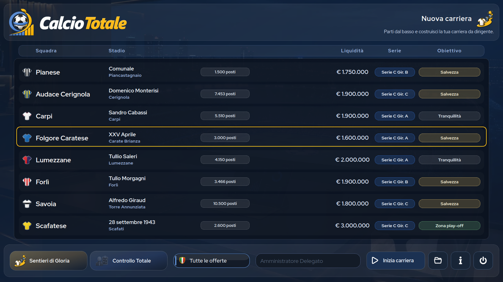

# CalcioTotale

[English](README.md) · [Español](README.es.md)

**CalcioTotale** è un gestionale calcistico per giocatore singolo ambientato nel calcio italiano. Interpreti l'amministratore delegato di un club e prendi decisioni sportive ed economiche. Questo repository distribuisce la **demo gratuita 1.0.2**, con contenuti calcistici della stagione 2026–27.

> **Lingue:** italiano, inglese e spagnolo. La demo offre tutte le funzionalità, ma ogni carriera termina alla fine del girone di andata della prima stagione.

  

<table>
  <tr>
    <td width="20%"></td>
    <td width="20%"></td>
    <td width="20%"></td>
    <td width="20%"></td>
    <td width="20%"></td>
  </tr>
  <tr>
    <td width="20%"></td>
    <td width="20%"></td>
    <td width="20%"></td>
    <td width="20%"></td>
    <td width="20%"></td>
  </tr>
</table>

## Scarica la demo

Pacchetti aggiornati il **1 ottobre 2026**. Scaricali dalla [release ufficiale 1.0.2](https://github.com/eleora-dev/calciototale/releases/tag/v1.0.2):

- [Windows 10/11 x64 — ZIP portabile](https://github.com/eleora-dev/calciototale/releases/download/v1.0.2/CalcioTotale-1.0.2-demo-windows-x64.zip)
- [Linux x86_64 — archivio portabile](https://github.com/eleora-dev/calciototale/releases/download/v1.0.2/CalcioTotale-1.0.2-demo-linux-x86_64.tar.gz)
- [Codici SHA256 per verificare i download](https://github.com/eleora-dev/calciototale/releases/download/v1.0.2/SHA256SUMS)

Entrambi i pacchetti sono autonomi e non richiedono l'installazione di Python. La versione completa e il codice sorgente non sono pubblicati in questo repository.

## Installazione e avvio

**Windows:** Estrai completamente lo ZIP in una cartella scrivibile, apri la directory `CalcioTotale` e avvia `CalcioTotale.exe`. Non avviare il gioco direttamente dallo ZIP e non collocare la cartella portabile in `Program Files`.

**Linux:** Estrai l'archivio e avvia `CalcioTotale/CalcioTotale`. La build è stata prodotta e verificata nel runtime Linux di Steam per sistemi desktop x86_64.

Le build portabili conservano i salvataggi in `user/` accanto all'eseguibile. La build Windows non è firmata e può mostrare un avviso di Microsoft Defender SmartScreen; scarica i file solo da questo repository ufficiale e verifica il codice SHA256 pubblicato.

## Caratteristiche principali

- *Solo la Maglia* lega la carriera a un club; *Sentieri di Gloria* segue un percorso dirigenziale tra società diverse.
- Gestisci personalmente formazione, tattiche, allenamento e partite, oppure delega le decisioni tecniche allo staff.
- Guida squadre di Serie A, Serie B e dei tre gironi di Serie C: 100 club italiani selezionabili e altri 145 club nel pacchetto stagionale.
- Affronta competizioni nazionali e internazionali, comprese coppe, play-off e tornei UEFA.
- Cura mercato, prestiti, contratti, osservazione, settore giovanile, staff, finanze, stadio e attività commerciali.
- Segui classifiche, calendari, cronache, statistiche e notizie contestuali; salva localmente le carriere in nove slot.

L'uscita della versione completa su [Steam](https://store.steampowered.com/app/5247020/Calcio_Totale/) è prevista per il **7 ottobre 2026**.

## Privacy e diritti

CalcioTotale è un gioco desktop offline. Non richiede un account CalcioTotale e non utilizza telemetria o pubblicità. I dati delle carriere vengono salvati localmente. Consulta l'[informativa sulla privacy](privacy.html) per i dettagli.

Le build ufficiali possono essere usate per scopi personali e non commerciali secondo la [licenza di CalcioTotale](LICENSE). Redistribuzione, modifica, pubblicazione e uso commerciale richiedono una preventiva autorizzazione scritta. I materiali di terze parti conservano i rispettivi diritti; consulta le [note sui componenti di terze parti](THIRD_PARTY_NOTICES.md) e i [testi delle licenze](licenses/README.md).

CalcioTotale è un progetto non ufficiale e non è affiliato né approvato da federazioni, leghe, competizioni, club, giocatori o fornitori di dati.

Gerardo Perilli · [Eleòra](https://github.com/eleora-dev)
