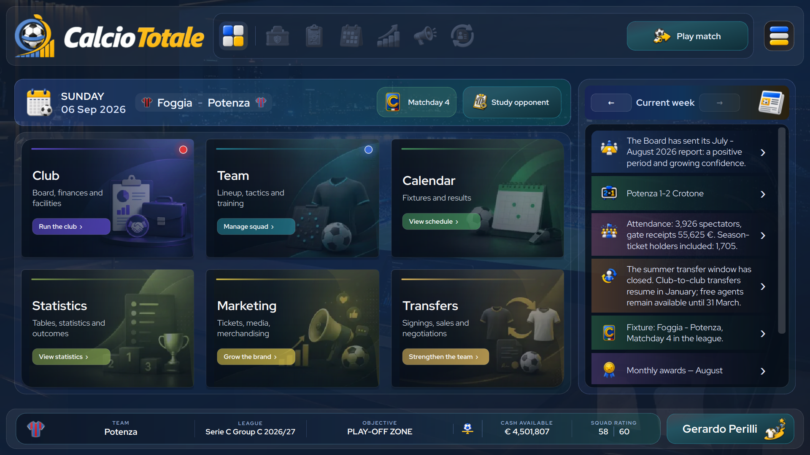
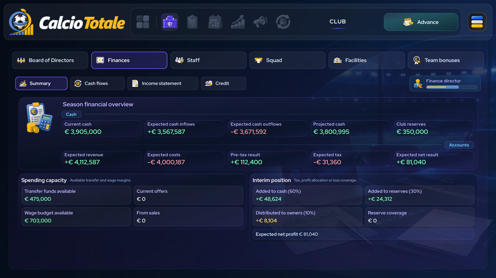
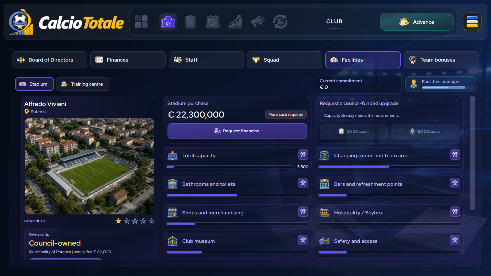
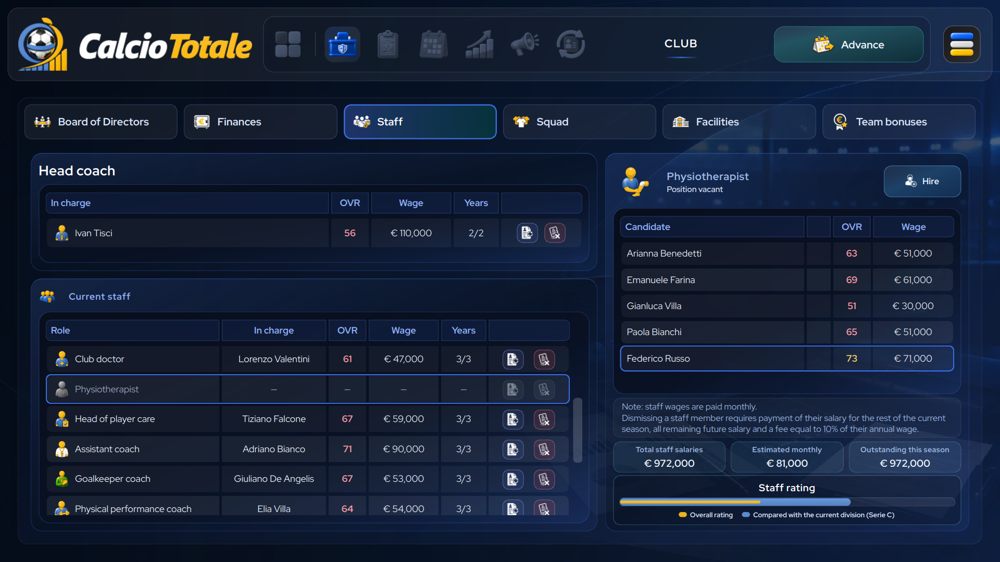
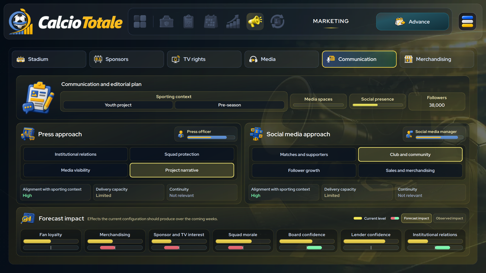
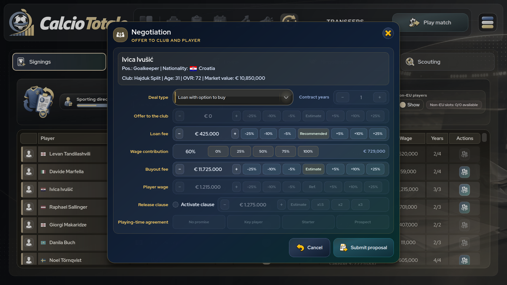
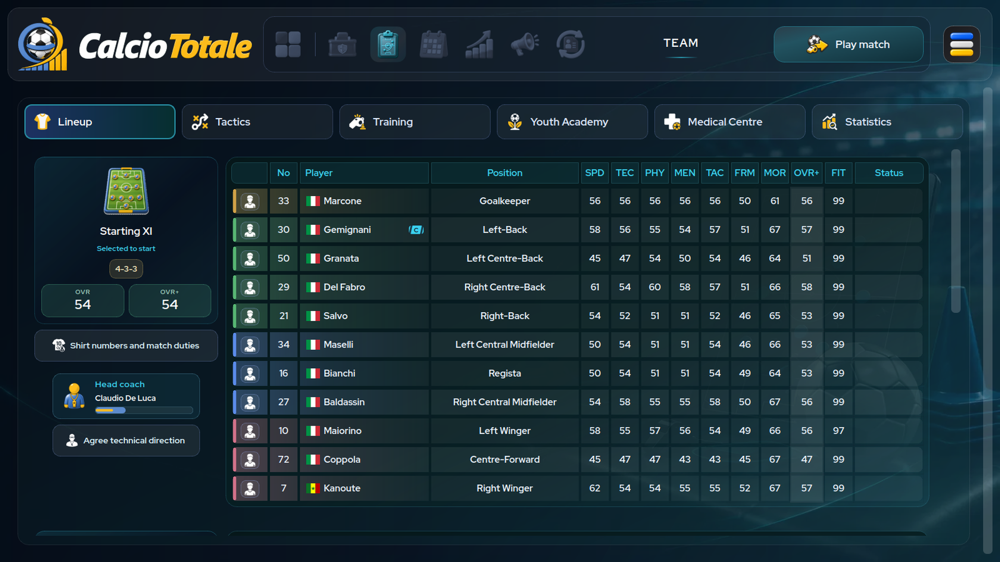
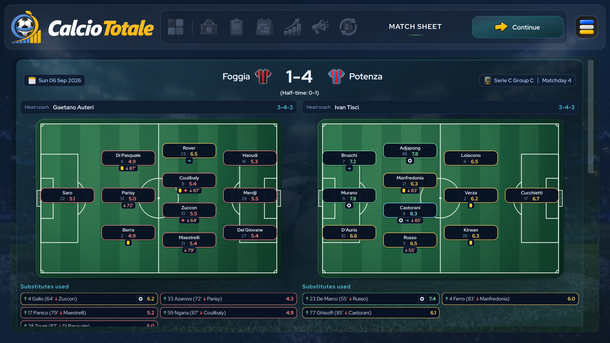
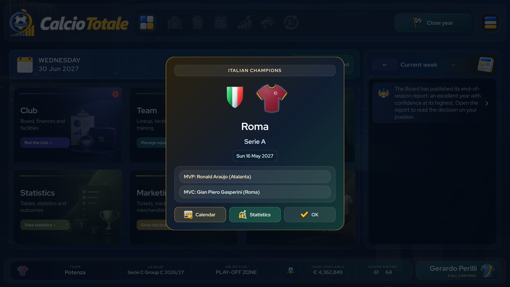
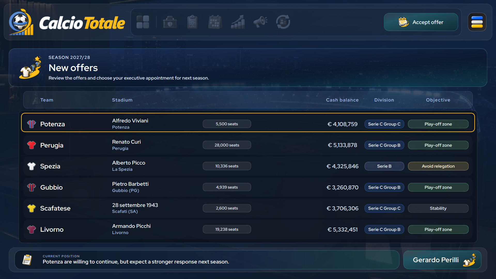

# CalcioTotale

[Versione italiana](README.it.md) · [Versión española](README.es.md)

**CalcioTotale** is a single-player football management game that captures the spirit of the genre's classics while shifting the perspective: you no longer play the traditional manager, but the club's chief executive. Define the club's strategy, build a sustainable organisation and face the sporting and financial consequences of every decision.

It is built with Python and PySide6. The current game version is **1.0.6**. The application is accompanied by a replaceable **2026-27** football content package.

> **Languages:** the interface is available in Italian, English and Spanish.


---

<table>
  <tr>
    <td width="20%"><a href="assets/branding/screenshots/en/01_home_en.png"></a></td>
    <td width="20%"><a href="assets/branding/screenshots/en/02_finances_en.png"></a></td>
    <td width="20%"><a href="assets/branding/screenshots/en/03_facilities_en.png"></a></td>
    <td width="20%"><a href="assets/branding/screenshots/en/04_staff_en.png"></a></td>
    <td width="20%"><a href="assets/branding/screenshots/en/05_marketing_en.png"></a></td>
  </tr>
  <tr>
    <td width="20%"><a href="assets/branding/screenshots/en/06_transfer_en.png"></a></td>
    <td width="20%"><a href="assets/branding/screenshots/en/07_squad_en.png"></a></td>
    <td width="20%"><a href="assets/branding/screenshots/en/08_matchday_en.png"></a></td>
    <td width="20%"><a href="assets/branding/screenshots/en/09_verdict_en.png"></a></td>
    <td width="20%"><a href="assets/branding/screenshots/en/10_career_en.png"></a></td>
  </tr>
</table>

---

## Current game

- **Two career modes** — *One Shirt* keeps the player at one club, while *Path to Glory* follows a director's career from the lower divisions through executive offers, board assessments and possible revocations of appointment.
- **Configurable technical control** — when *Total control* is disabled, line-ups, tactics, training and match management are delegated to the technical staff according to its quality and assigned mandate; enabling it gives every technical decision directly to the player.
- **Five playable leagues** — Serie A, Serie B and all three Serie C groups, with 100 selectable Italian clubs plus 145 non-selectable European and world-pool clubs in the supplied seasonal content package.
- **Domestic football** — league seasons, Coppa Italia, Coppa Italia Serie C, Supercoppa Italiana, Serie B play-offs/play-outs and Serie C post-season.
- **International competitions** — UEFA Champions League, Europa League, Conference League, UEFA Super Cup, Intercontinental Cup and Club World Cup, with qualifying play-offs, draws, league phases and season-to-season progression.
- **Squad and match management** — formations, line-ups, tactics, shirt numbers, player roles, match preparation, weekly training, injuries, illnesses, suspensions and match reports.
- **Club management** — board objectives and reports, cash flows, income statement, player-registration accounting, contracts, team bonuses, credit, recapitalisation, staff, stadium and training-centre development, and stadium-rent renegotiation with the owner.
- **Transfers and scouting** — signings, sales, loans, negotiations, pre-contracts, transfer and loan lists, watched players and youth recruitment.
- **Commercial management** — ticketing and season tickets, sponsors, TV rights, press and official communication, social channels and merchandising.
- **Youth and development** — academy prospects, promotion paths, technical growth, personalities and individual treatment.
- **Statistics and news** — tables, calendars, competition filters, player and team reports, awards, records and contextual news.
- **Local saves** — nine career slots stored in the local `user/` directory; portable Windows and Linux builds keep it beside the executable, system packages use the user's data directory, and macOS uses `~/Library/Application Support/CalcioTotale/user/`.
- **Three interface languages** — Italian, English and Spanish use matching localisation catalogues; the default follows the system language and a manual choice is stored locally.

## Runtime and privacy

CalcioTotale is an offline desktop game:

- it does not create or require its own account or an Eleòra-operated server;
- it does not use telemetry, analytics or advertising services;
- normal gameplay does not make network requests;
- career data is saved locally; in the Steam edition it may be synchronised by the Steam client when Steam Cloud is enabled.

The links in the About dialog open the user's default browser only when selected; any resulting connection is made by that browser to the linked website, not by the game runtime.

See [privacy.html](privacy.html) for the complete bilingual privacy policy.

## Technical overview

Within the project structure, **CalcioTotale** means the application, while the entire `data/` directory is a separate, replaceable football content package. The package is placed beside the application so that it can be read locally, but it is not part of the proprietary CalcioTotale material.

- `data/data.json.gz` contains the seasonal data as gzip-compressed UTF-8 JSON: 245 clubs, 6,475 players, names, short names, organisers, identifying-shirt colours and patterns, and neutral competition-icon identifiers.
- `assets/competitions/` contains the application’s fixed, generic competition illustrations. Database fields `icon`, `organizer_icon`, `trophy_icon` and `winter_champion_icon` select neutral asset identifiers (for example, `continental_cup_1`); changing competition names or organisers does not change the images or their location. Competition articles are declared in `article_it` and `article_es` in the database.
- `catalogs/` contains database I/O, static-record schemas and access to the replaceable game catalogues.
- `models/` defines clubs, players, staff, matches, standings, facilities, economic data and the season-objective policy.
- `engine/` contains world construction, match simulation, calendars, competitions, transfers, contracts, finance, news, training and season progression.
- `ui/` contains the PySide6 interface, dialogs, styling and presentation logic.
- `locales/locale_it.py`, `locales/locale_en.py` and `locales/locale_es.py` contain the matching Italian, English and Spanish catalogues; `locales/runtime_settings.py` manages the local language preference.
- `assets/` contains local branding, backgrounds, interface icons, flags, fonts competition illustrations and other visual resources.
- `user/` is created at runtime for local save slots and their summaries.

The reference environment is Fedora Linux with KDE Plasma. The source also contains display handling for Windows and macOS, but only official builds explicitly published for a platform should be considered supported.

## Requirements for the source version

- Python 3.10 or newer
- PySide6 6.7 or newer, below version 7
- a working graphical desktop environment
- a display of at least 1280 × 720 for the fixed 1600 × 900 game surface and its automatic cross-platform scaling

For an authorised development copy:

```bash
python3 -B -m venv .venv
source .venv/bin/activate
python3 -B -m pip install -r requirements.txt
python3 -B calciototale.py
```

To start the demo directly from the same source tree:

```bash
python3 -B calciototale.py --demo
```

## Development checks

The runner includes both `unittest` cases and standalone `test_*` functions. Each module runs in a separate process with temporary user data. The full suite is split into four serial parts and runs one module at a time to avoid memory spikes; UI tests use Qt offscreen.

```bash
PYTHONPATH=. python3 -B tools/run_tests.py
```

State, logs and failures are saved atomically after every module under `.test-results/full-suite`. After an interruption, `--resume` runs only missing or interrupted modules; `--retry-failures` reruns unsuccessful ones. Starting without either option creates a fresh session. To run selected modules, pass their names without `.py`; `--parts`, `--jobs`, `--timeout` and `--log-dir` explicitly override the defaults.

```bash
PYTHONPATH=. python3 -B tools/run_tests.py --resume
PYTHONPATH=. python3 -B tools/run_tests.py --retry-failures
```

## Distribution

The `calciototale-src` source repository is private. The full version is distributed through [Steam](https://store.steampowered.com/app/5247020/Calcio_Totale/), while the public [`calciototale`](https://github.com/eleora-dev/calciototale) repository distributes demo packages exclusively.

Official executable builds may be downloaded, installed and used only for personal, non-commercial purposes under [LICENSE](LICENSE). Source access, redistribution, modification, publication and commercial use require prior written authorisation. Do not redistribute builds or rely on unofficial mirrors.

The Windows x64 portable-build procedure is documented in [packaging/windows/README.md](packaging/windows/README.md). Linux x86_64 portable and Fedora RPM builds are documented in [packaging/linux/README.md](packaging/linux/README.md). The `.app` bundle for Apple Silicon, Intel Macs or Universal 2, including signing and notarization, is documented in [packaging/macos/README.md](packaging/macos/README.md). Every format creates an autonomous payload composed of the application, its dependencies and the separate content package placed under `data/`; the end user does not install Python packages.

The manual `Build Steam and demo packages` workflow builds and verifies both editions for Windows x64 and Linux x86_64 in the Steam runtime. Full packages remain private workflow artifacts intended for the Steam depots; when publication is requested, only demo packages are uploaded to the public [`calciototale`](https://github.com/eleora-dev/calciototale) release. The macOS and RPM procedures remain available for manual use but are excluded from the current distribution.

During packaging, dynamically loaded UI modules are transformed into a compressed binary bundle. Every build script aborts if a plain Python `.py` source file is found in the final package.

## Project structure

```text
assets/                   Branding, backgrounds, icons, flags, fonts and UI media
catalogs/                 Static database I/O, schemas, configuration and catalogue access
data/                     Separate, replaceable football content package
engine/                   World construction, simulation, and game-state logic
licenses/                 Included third-party license texts
locales/                  Italian/English/Spanish catalogues and language preferences
models/                   Domain models, identifiers, policies and constants
packaging/windows/        PyInstaller recipe and PowerShell build script
packaging/linux/          Shared Linux payload, portable archive and Fedora RPM
packaging/macos/          .app bundle, signing, notarization and ZIP archive
engine/runtime_paths.py   Platform-specific data paths for desktop builds
ui/                       PySide6 interface, palette and styling
calciototale.py           Application entry point
LICENSE                   CalcioTotale proprietary license
THIRD_PARTY_NOTICES.md    Third-party components, assets and rights
privacy.html              English and Italian privacy policy
user/                     Local saves, summaries and preferences, created when needed
```

## License and third-party rights

Original CalcioTotale code, documentation and original application assets are proprietary and all rights are reserved. The entire `data/` directory is a separate content package and is excluded from the proprietary license. See [LICENSE](LICENSE).

Third-party components and materials remain under their own licenses, terms and rights. The current repository specifically documents:

- **Python** — Python Software Foundation License Version 2 and the licenses of components incorporated into the Python distribution;
- **PySide6 / Qt for Python** — automated builds use the Community distribution under LGPLv3/GPLv3; a Qt commercial distribution requires a separate pipeline and terms;
- **PyInstaller** — GPLv2 or later with the specific exception for the bootloader embedded in executable builds;
- **Pillow** — MIT-CMU License; used only while packaging application icons and not by the game runtime;
- **Google Material Symbols / Material Design icons** — Apache License 2.0 for applicable derived icons;
- **Red Hat Display** — SIL Open Font License 1.1, used for the interface and trailer body text;
- **Oxanium** — SIL Open Font License 1.1, used for shirt sponsors and trailer headings;
- **flag-icons** — MIT License for applicable country and territory SVG flags;
- **Kenney Cursor Pack** — CC0 1.0 for the arrow, hand, help and text cursors;
- **`data/` package** — its database and competition images are separate from the application; the corresponding rights remain with their respective owners.

See [THIRD_PARTY_NOTICES.md](THIRD_PARTY_NOTICES.md) and the [`licenses/`](licenses/) directory. CalcioTotale is unofficial and is not affiliated with, endorsed by or sponsored by any football federation, league, competition, club, player or data provider.

## Author

Gerardo Perilli · [Eleòra](https://github.com/eleora-dev)
