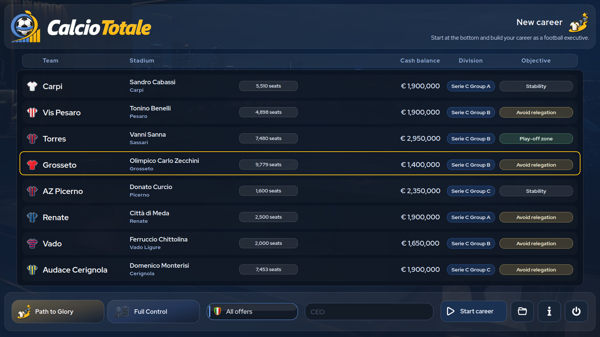

# CalcioTotale

[Italiano](README.it.md) · [Español](README.es.md)

**CalcioTotale** is a single-player football management game set in Italian club football. You take charge as a club's chief executive, making sporting and financial decisions. This repository distributes the free **1.0.2 demo**, with 2026–27 football content.

> **Languages:** English, Italian and Spanish. The demo has all gameplay features, but each career ends after the first half of its opening season.

  

<table>
  <tr>
    <td width="20%"></td>
    <td width="20%"></td>
    <td width="20%"></td>
    <td width="20%"></td>
    <td width="20%"></td>
  </tr>
  <tr>
    <td width="20%"></td>
    <td width="20%"></td>
    <td width="20%"></td>
    <td width="20%"></td>
    <td width="20%"></td>
  </tr>
</table>

## Download the demo

Packages updated **1 October 2026**. Download them from the [official 1.0.2 release](https://github.com/eleora-dev/calciototale/releases/tag/v1.0.2):

- [Windows 10/11 x64 — portable ZIP](https://github.com/eleora-dev/calciototale/releases/download/v1.0.2/CalcioTotale-1.0.2-demo-windows-x64.zip)
- [Linux x86_64 — portable archive](https://github.com/eleora-dev/calciototale/releases/download/v1.0.2/CalcioTotale-1.0.2-demo-linux-x86_64.tar.gz)
- [SHA256 checksums](https://github.com/eleora-dev/calciototale/releases/download/v1.0.2/SHA256SUMS)

Both packages are self-contained and require no Python installation. The full game and source code are not published in this repository.

## Install and play

**Windows:** Extract the ZIP completely into a writable folder, open the `CalcioTotale` directory and run `CalcioTotale.exe`. Do not run the game from inside the ZIP or place the portable folder in `Program Files`.

**Linux:** Extract the archive and run `CalcioTotale/CalcioTotale`. The build was produced and smoke-tested in the Steam Linux Runtime for x86_64 desktop Linux.

Portable builds keep career saves in `user/` beside the executable. The unsigned Windows build may display a Microsoft Defender SmartScreen warning; download only from this official repository and check the published SHA256 digest.

## Main features

- *One Shirt* keeps you at one club; *Path to Glory* follows a director's career across clubs.
- Direct formations, tactics, training and matches yourself, or delegate technical decisions to your staff.
- Manage clubs in Serie A, Serie B and all three Serie C groups: 100 selectable Italian clubs and 145 additional clubs in the seasonal content package.
- Play domestic and international competitions, including cups, play-offs and UEFA tournaments.
- Handle transfers, loans, contracts, scouting, youth development, staff, finances, stadium facilities and commercial activities.
- Follow tables, calendars, match reports, statistics and contextual news; save careers locally in nine slots.

The full version is planned for **7 October 2026** on [Steam](https://store.steampowered.com/app/5247020/Calcio_Totale/).

## Privacy and rights

CalcioTotale is an offline desktop game. It requires no CalcioTotale account and uses no telemetry or advertising. Career data is saved locally. Read the [privacy policy](privacy.html) for details.

Official builds may be used for personal, non-commercial purposes under the [CalcioTotale license](LICENSE). Redistribution, modification, publication and commercial use require prior written authorisation. Third-party materials retain their own rights; see [third-party notices](THIRD_PARTY_NOTICES.md) and the included [license texts](licenses/README.md).

CalcioTotale is unofficial and is not affiliated with or endorsed by any football federation, league, competition, club, player or data provider.

Gerardo Perilli · [Eleòra](https://github.com/eleora-dev)
